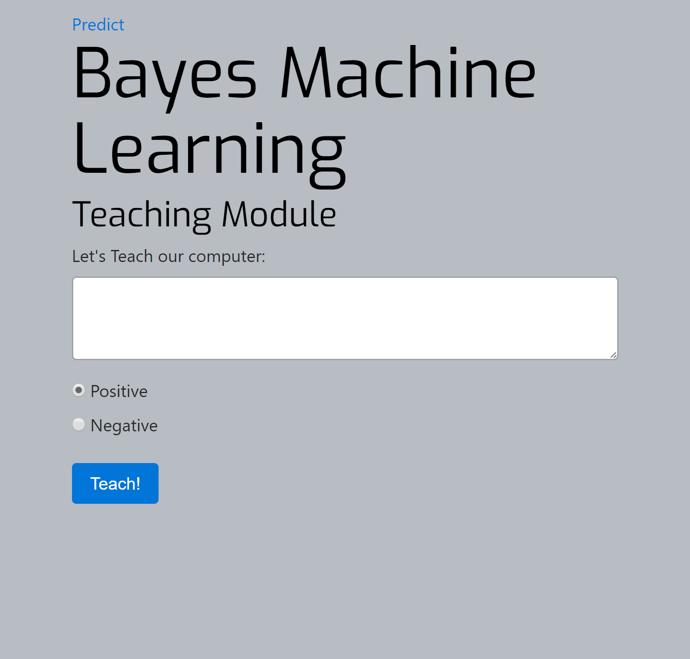

# Naive Bayes Text Classifier

A simple app for testing _Machine Learning_ with **[Naive Bayes Algorithm](https://en.wikipedia.org/wiki/Naive_Bayes_classifier)**

## Install application

In order to install the NBTC app in your computer you will need **[node.js](https://nodejs.org/en/)** and **[bower](https://bower.io/)**

If you have installed node.js, you may install the bower package manager by writing on the terminal:

```
$ npm install -g bower
```

Now you are ready to **clone this repository** on the chosen parent folder and go to the app folder.

```
$ git clone https://github.com/sgarmendia/naiveBayesLearning

$ cd naiveBayesLearning
```

And run the application:

```
$ npm start
```

Open your browser on `http://localhost:3000/` and you are ready to start!

## Using the NBTC App

The application classifies text with two labels: _positive_ or _negative_

The app lands on the prediction module, where the user can type any text for analysis. It is recommended to write only with letter without special punctuation.


On the teaching module, the user can "teach" the computer to classify any text as _positive_ or _negative_:



The app is pre taught with a limited vocabulary (see learnJson.json file in the **_learning/_** folder) of basic english words and phrases that are classified as either _positive_ or _negative_.

The user may teach words or phrases on top of the pre learned ones, or if the user wishes to teach the computer from scratch, you may manually set the numerical values in the JSON file to _zero_ and erase al the vocabulary array. (do not change the parameters on the first index of the JSON file).

The user may teach the computer in any other western language (although for better results it is recommended clearing the JSON file).

If the user wishes to return to the initial state you may erase the NBTC app folder and clone the repo again, or make a copy of the json file and rewrite when needed.

I hope you enjoy your experience with the Naive Bayes Text Classifier APP.

--------------------------------------------------------------------------------

Made by **_Simon Garmendia_**<br>
<br>
email: sgarmendia@gmail.com<br>
twitter: @simongarm<br>
medium: [@sgarmendia](https://medium.com/@sgarmendia)<br>
blog: [sgcodingblog](https://sgcodingblog.wordpress.com/)<br>
<br>
This app is under freeware
